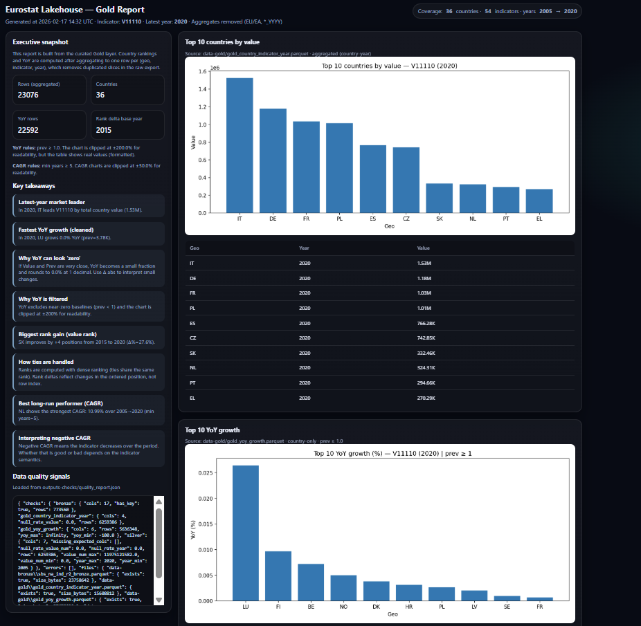
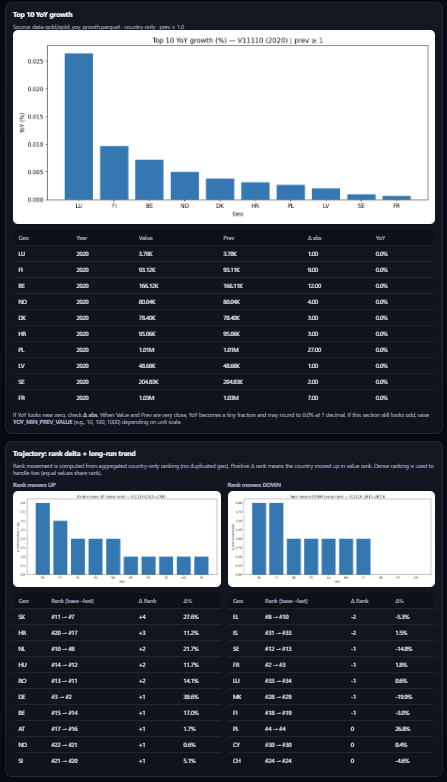

# 🚀 Eurostat Lakehouse 
**Airflow + AWS S3 + Production-Style Data Engineering**

End-to-end Data Engineering project using **Eurostat Structural Business Statistics (SBS)**.

This repository implements a reproducible **Lakehouse architecture (Bronze → Silver → Gold)**, orchestrated with **Apache Airflow**, generating analytical marts and a production-style **HTML analytics report**, published to **AWS S3**.

---

# 📌 What This Project Demonstrates

- Lakehouse data modeling (Bronze / Silver / Gold separation)
- Real-world Eurostat data handling (TSV, flags, wide-year format)
- Clean dimensional modeling
- Airflow DAG orchestration
- Data quality checks with JSON audit output
- Automated HTML report generation (charts + metrics)
- AWS S3 publishing via CLI
- Production-style repository organization
- Git-based version control

---

# 🏗 Architecture

## 🔄 Data Flow

Eurostat Raw Data  
⬇  
🥉 Bronze (Parquet + metadata)  
⬇  
🥈 Silver (Normalized + cleaned + typed)  
⬇  
🥇 Gold (Analytics marts + derived metrics)  
⬇  
📊 HTML Report (charts + rankings + YoY + structural metrics)  
⬇  
☁ AWS S3 Publish  

---

# 📂 Repository Structure

```text
eurostat-lakehouse/
├─ airflow/
│  ├─ dags/
│  │  └─ eurostat_lakehouse_dag.py
│  └─ logs/
├─ data-raw/
├─ data-bronze/
├─ data-silver/
├─ data-gold/
├─ outputs-checks/
│  └─ quality_report.json
├─ reports/
│  ├─ templates/
│  │  ├─ gold_report.html
│  │  └─ report.css
│  ├─ out/
│  │  ├─ assets/
│  │  └─ gold_report.html
│  └─ generate_gold_report.py
├─ src/
│  ├─ 00_download_raw.py
│  ├─ 01_extract_raw.py
│  ├─ 02_bronze_ingest.py
│  ├─ 03_silver_transform.py
│  ├─ 04_gold_analytics.py
│  ├─ 05_quality_checks.py
│  ├─ config.py
│  ├─ datasets.json
│  ├─ run_all.py
│  └─ utils.py
├─ docker-compose.yml
├─ Dockerfile
├─ requirements.txt
└─ README.md
```

---

# 🥉 Bronze Layer

**Goal:** Preserve source fidelity with minimal transformation.

- Reads Eurostat TSV / TSV.GZ exactly as downloaded
- Adds ingestion metadata (`source_file`, `ingested_at`)
- Stores structured Parquet files
- No heavy cleaning

Output:
```
data-bronze/*.parquet
```

---

# 🥈 Silver Layer

**Goal:** Normalize and clean the dataset for analytics.

## Transformations performed:

- Split combined Eurostat dimension column into:
  - `freq`
  - `nace_r2`
  - `indic_sbs`
  - `geo`

- Convert wide year columns (2005…2020) → long format:
  - `year`
  - `value`

- Clean Eurostat tokens:
  - `:` → NULL
  - `e`, `p`, `b` → numeric extraction

- Enforce numeric typing
- Ensure one row per `(geo, indic_sbs, year)`

Output:
```
data-silver/*.parquet
```

---

# 🥇 Gold Layer

**Goal:** Build analytical data marts.

## Gold outputs:

### 1️⃣ Country Indicator Year
`gold_country_indicator_year.parquet`

One row per:
```
(geo, indic_sbs, year)
```

### 2️⃣ YoY Growth
`gold_yoy_growth.parquet`

Computed as:
```
(value / value_prev - 1) * 100
```

### 3️⃣ Structural Metrics
`gold_structural_metrics.parquet`

Includes:
- CAGR
- Absolute change
- Percentage change
- YoY mean
- YoY volatility
- Rank delta

---

# 📊 HTML Analytics Report

Generated via:

```
python reports/generate_gold_report.py
```

Produces:

```
reports/out/gold_report.html
reports/out/assets/*.png
```

Includes:
- Top countries by value
- Top YoY growth
- Rank movers
- CAGR leaders
- Coverage statistics
- Data quality metrics

---

# ☁ AWS S3 Publishing

## Configure AWS CLI

```
aws configure
```

Then verify:

```
aws sts get-caller-identity
```

## Upload Report

```
aws s3 cp reports/out/gold_report.html s3://<your-bucket>/reports/gold_report.html --region us-east-2

aws s3 sync reports/out/assets s3://<your-bucket>/reports/assets --region us-east-2
```

## Verify

```
aws s3 ls s3://<your-bucket>/reports --region us-east-2
```

# 🌐 Live Analytics Report (AWS S3 Deployment)

Production-style HTML report deployed to AWS S3:

👉 (http://mauricio-eurostat-lakehouse-prod.s3-website.us-east-2.amazonaws.com/reports/latest/gold_report.html)

The report includes dynamically generated analytics from the Gold layer, including rankings, YoY growth, CAGR metrics, structural indicators, and data quality validation summaries.

---

# 📊 Report Preview

Below are sample sections from the production-style analytics report:

## Structural Metrics Overview


## Top Countries by Indicator


## YoY Growth & Rank Movers


---

# 🏭 Production Considerations

This project was designed with production-readiness principles:

- Layered Lakehouse architecture (Bronze → Silver → Gold)
- Idempotent transformation logic
- Explicit schema enforcement
- Data quality validation before publishing
- Deterministic ranking logic
- Outlier clipping logic for visualization stability
- Separation between computation and presentation layers
- S3 publishing as deployment step

Potential production upgrades:

- CI/CD pipeline with GitHub Actions
- IAM role-based S3 access
- Cloud-native orchestration (AWS MWAA)
- Delta Lake storage format
- Daily scheduled pipeline execution
- Infrastructure-as-Code (Terraform)

---

# ☁ Scalability & Cloud Readiness

Although executed locally, the architecture is cloud-ready:

- Parquet-based storage for scalable analytics
- Modular transformation scripts
- Airflow-based orchestration
- S3-ready deployment
- Structured analytical marts

The pipeline can be migrated to:

- AWS Glue
- Amazon MWAA
- Databricks
- Azure Data Factory
- Snowflake
- BigQuery

---

# ⚡ Performance Notes

- Parquet reduces I/O footprint
- Vectorized Pandas transformations
- Efficient YoY computation using grouped shifts
- Controlled aggregation logic
- Safe numeric casting with coercion handling
- Memory-safe transformations for wide-to-long reshaping

---

# ⚙ Running the Pipeline

## 1️⃣ Create virtual environment

Windows PowerShell:

```
python -m venv .venv
.\.venv\Scripts\Activate.ps1
pip install -r requirements.txt
```

## 2️⃣ Run Full Pipeline

```
python src/run_all.py
```

or individually:

```
python src/02_bronze_ingest.py
python src/03_silver_transform.py
python src/04_gold_analytics.py
python src/05_quality_checks.py
```

---

# 🔄 Airflow Orchestration

Run via Docker:

```
docker compose up -d
```

Open:

```
http://localhost:8080
```

Enable DAG:
```
eurostat_lakehouse_dag
```

---

# 🧪 Data Quality

Quality checks generate:

```
outputs-checks/quality_report.json
```

Includes:
- Row counts by layer
- Null percentage
- Schema validation
- Numeric conversion validation
- Coverage metrics

---

# 📈 Key Engineering Highlights

- Proper Lakehouse separation
- Deterministic transformations
- Aggregation control (duplicate handling)
- Ranking with dense logic
- Safe numeric casting
- Chart clipping logic for outliers
- Clean AWS S3 integration
- Production-style project layout

---

# 🛠 Tech Stack

- Python 3.11+
- Pandas
- PyArrow
- Apache Airflow
- Matplotlib
- Jinja2
- AWS CLI
- Docker
- S3

---

# 📚 Data Source

Eurostat – Structural Business Statistics (SBS)  
https://ec.europa.eu/eurostat

---

# 👨‍💻 Author

Mauricio Esquivel  
Data Engineer | Analytics Engineer  
Focus: Lakehouse Architecture, Orchestration, Cloud Data Platforms
